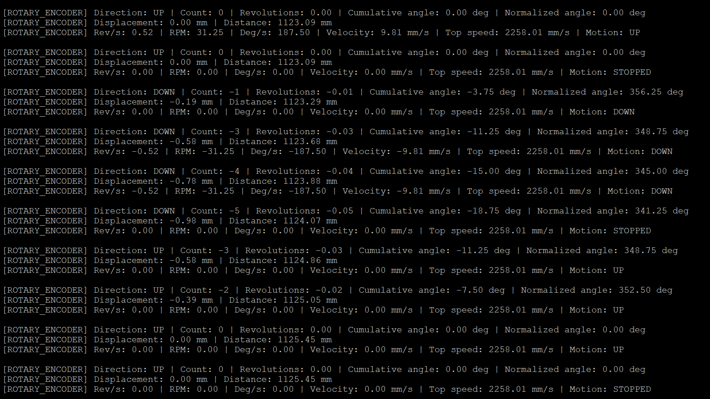

# STM32G070 Bare-Metal Timer Encoder Driver

<p align="center">
  
</p>

A bare-metal quadrature encoder driver for the **STM32G070** built entirely using the CMSIS device headers. No HAL or LL libraries are used.

The STM32 timer is configured in **hardware encoder mode**, allowing the timer peripheral to decode quadrature signals directly with essentially zero CPU overhead.

---

## Overview
Mechanical rotary encoders produce two square waves (A and B) that are 90° out of phase. By observing which signal changes first, the STM32 timer can determine:

- Position
- Rotation direction
- Encoder counts

Rather than decoding these signals in software, the STM32 timer performs the quadrature decoding completely in hardware.

The driver then builds upon this hardware capability by providing a higher-level rotary encoder interface that exposes:

- Position
- Distance traveled
- Velocity
- Motion state (UP / DOWN / STOPPED)
---

## Hardware Used
- STM32G070 Nucleo
- Mechanical rotary knob encoder
- UART debugging
---

## Features

### Timer Encoder Driver
- CMSIS register-level implementation
- Hardware quadrature decoding
- Configurable Encoder modes
   - TI1
   - TI2
   - TI1 + TI2
- Configurable input polarity
- Configurable digital filters
- Configurable input prescalers
- Position counter API
- Direction API

### Rotary Encoder Driver
- Position tracking
- Distance accumulation
- Velocity calculation
- Motion detection
- STOPPED state detection
- Application-friendly abstraction layer

---

## Driver Architecture
```
Application
     │
     ▼
rotary_encoder.c
     │
     ▼
timer_encoder.c
     │
     ▼
TIM3 Hardware Encoder Mode
     │
     ▼
Mechanical Rotary Encoder
```
The project is intentionally layered.

- **timer_encoder.c** configures and controls the STM32 timer peripheral.
- **rotary_encoder.c** converts raw timer counts into useful motion information.
- **Application** simply requests data without needing to understand timer registers.

---
## Demonstration

<p align="center">
  
</p>

The application periodically reports:

- Encoder count
- Direction
- Distance traveled
- Velocity
- Motion state

Motion is automatically classified as:

- UP
- DOWN
- STOPPED

The STOPPED state uses multiple consecutive zero-velocity measurements to avoid falsely reporting a stop due to brief pauses between encoder detents.

---

## Example Output
```text
[ROTARY_ENCODER] Count:      521
[ROTARY_ENCODER] Direction:  UP
[ROTARY_ENCODER] Distance:   521
[ROTARY_ENCODER] Velocity:   168 counts/sec
[ROTARY_ENCODER] Motion:     UP

[ROTARY_ENCODER] Count:      521
[ROTARY_ENCODER] Direction:  UP
[ROTARY_ENCODER] Distance:   521
[ROTARY_ENCODER] Velocity:   0 counts/sec
[ROTARY_ENCODER] Motion:     STOPPED
```
---

## What I learned
This project provided a much deeper understanding of how STM32 timers can be used beyond simple timing applications.

Some of the concepts explored include:

- Quadrature encoder operation
- Hardware encoder mode
- Timer input capture channels
- Encoder counting modes
- Rotation direction detection
- Digital input filtering
- Alternate-function routing
- Register-level peripheral configuration
- Velocity estimation from sampled position
- Motion state detection
- Designing layered embedded drivers
---

## Future Work
- Index (Z) channel support
- Quadrature encoder support for DC motors
- Integration with PWM motor drivers
- Closed-loop PID motor control
---

## Repository Structure

```
Drivers/
├── timer_encoder/
│   ├── timer_encoder.c
│   └── timer_encoder.h
│
├── rotary_encoder/
│   ├── rotary_encoder.c
│   └── rotary_encoder.h
│
└── ...
```

The timer encoder driver is reusable for any incremental quadrature encoder supported by an STM32 timer configured in encoder mode. The higher-level rotary encoder driver demonstrates how raw hardware counts can be transformed into meaningful motion information suitable for embedded applications.